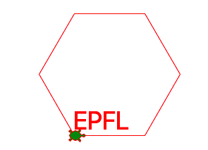

Introduction à la programmation
===============================

Dans ce tutoriel tu vas apprendre à programmer dans un langage qui s'appelle **Python**.
Tu vas programmer les déplacements d'une tortue. Voici à quoi ça va ressembler.

:download:`epfl1.py <epfl1.py>`

Cette tortue laisse une trace qui te permet de faire des dessins.
Mais tout d'abord tu dois télécharger un outil de travail.

Installer un éditeur
--------------------

Vas sur le site https://thonny.org
et télécharge l'application **Thonny**.

C'est un éditeur de programme qui permet de

- **écrire** un programme
- **executer** ce programme
- **afficher** le résultat

.. image:: thonny.png

Dans Thonny tu as trois régions

- les **boutons** pour *Créer, Ouvrir, Sauvegarder, Executer* un programme
- la partie **éditeur** pour écrire un programme entier (<untitled>)
- la **console** pour executer des commandes courtes (Shell)

Les premiers pas
----------------

Dans la console (ou Shell) tu peux directement entrer des expression courtes que Python peut évaluer.
Après les 3 chevrons (>>>) tu peux écrire cette addition::

    >>> 1 + 2
    3

Tu peux aussi essayer Cette muliplication::

    >>> 12 + 13
    156

Dans Python tu n'es pas limité dans le nombre de chiffre qu'un calcul peut produire.
Voici cette puissance de deux nombres qui donne un résultat qui s'étale sur 5 lignes::

    >>> 123 ** 123
    11437436793461719009988029522806627674621807845185022977588797
    50523695047856668964466065683652015421696499747277306288423453
    43196581134895919942820874449837212099476648958359023796078549
    04194900780722062535652692672966406484668575838280370710076674
    0220839267

Controler une tortue
--------------------

Par la suite nous allons utiliser le module ``turtle`` tortue.
Pour pouvoir l'utiliser nous devons importer ce module au début du programme::

    >>> import turtle

Ensuite nous pouveons cette tortue à l'aide des commandes

    >>> turtle.forward(100)

Cette commande fait avancer la tortue de 100 pixels.
Une commande pour contrôler la tortue a la forme suivante:

- un premier mot qui est ``turtle``
- un point ``.``
- une commande (forward, backward, left, right, etc.)
- des parenthèses ``( )``
- un argumen numériques (distance, angle)

Pour la faire reculer de 200 pixels::

    >>> turtle.backward(200)

Pour faire tourner la tortue 90 degrès à gauche::

    >>> turtle.left(90)

Pour faire tourner la tortue 45 degrès à droite::

    >>> turtle.right(45)

Ecrire un programme
-------------------

Tous ces commandes que tu peux écrire directement dans la console, 
tu peux aussi les mettre dans un programme (qu'on appelle script).
Une fois le programme terminé, tu peux l'executer à l'aide du bouton vert **Executer**.

.. image:: intro2.png

.. literalinclude:: intro2.py
:download:`intro2.py <intro2.py>`