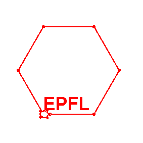
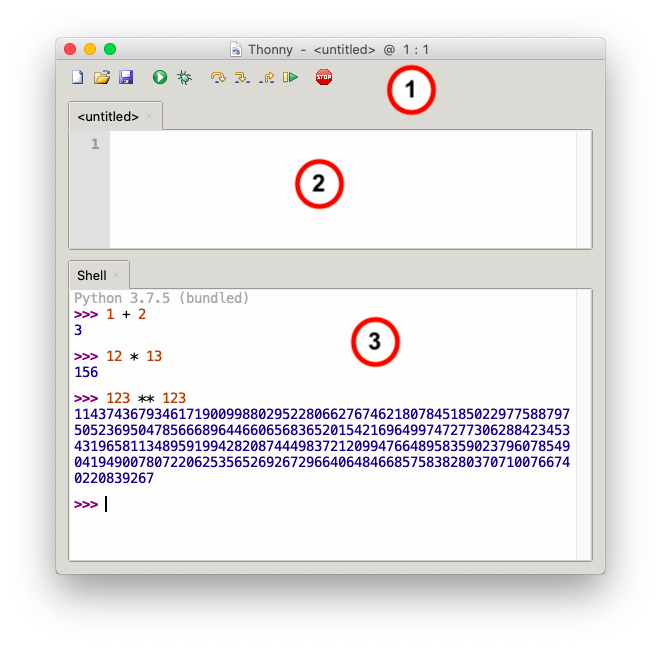
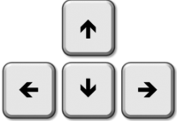
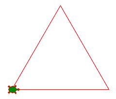
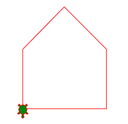
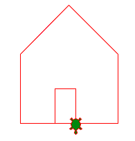

Introduction
============

Dans ce tutoriel, tu vas apprendre à programmer dans un langage qui s'appelle **Python**.
Tu vas programmer les déplacements d'une tortue. Voici à quoi ça va ressembler.

:download:`epfl1.py <epfl1.py>`

Cette tortue laisse une trace qui te permet de faire des dessins.
Mais tout d'abord, tu dois télécharger un outil pour programmer.

Installer un éditeur
--------------------

Va sur le site https://thonny.org
et télécharge l'application **Thonny**.

C'est un éditeur de programme qui te permet:

- d\\'**écrire** un programme
- d\\'**exécuter** ce programme
- d\\'**afficher** le résultat

Dans une fenêtre de Thonny tu as trois régions:

#. les **boutons** pour *Créer, Ouvrir, Sauvegarder, Exécuter* un programme
#. la partie **éditeur** pour écrire un programme entier
#. la **console** pour executer des commandes courtes (Shell)

Les premiers pas
----------------

Dans la console (ou Shell), tu peux directement entrer des expressions courtes que Python va évaluer.
Après les 3 chevrons (>>>) tu peux écrire cette addition::

    >>> 1 + 2
    3

Tu peux aussi essayer cette muliplication::

    >>> 12 * 13
    156

Python n'est pas limité dans le nombre de chiffres qu'un calcul peut produire.
Voici une puissance (**) de deux nombres qui donne un résultat qui s'étale sur 5 lignes::

    >>> 123 ** 123
    11437436793461719009988029522806627674621807845185022977588797
    50523695047856668964466065683652015421696499747277306288423453
    43196581134895919942820874449837212099476648958359023796078549
    04194900780722062535652692672966406484668575838280370710076674
    0220839267

Dessiner avec une tortue
------------------------

Dans cet exercice, on va s'entrainer en n'utilisant que la console, donc la partie basse 
de la fenêtre. Cela te permet de voir directement l'effet d'une commande.

Par la suite, nous allons utiliser le module ``turtle``.
Ce module te permet de déplacer une tortue sur l'écran, 
à l'aide des commandes que tu programmes.

Pour pouvoir utiliser ce module, tu dois l'importer au début du programme::

    >>> from turtle import *

Ensuite tu peux donner un ordre à ta tortue::

    >>> forward(100)

Cette commande fait avancer la tortue de 100 pixels. 
Une commande pour contrôler la tortue a la forme suivante:

- une commande (forward, backward, left, right, etc.)
- des parenthèses ``( )``
- un argument numériques (distance, angle)

Par exemple, pour faire reculer la tortue de 200 pixels, écris ceci::

    >>> backward(200)

Pour faire tourner la tortue de 90 degrés vers la gauche::

    >>> left(90)

Pour faire tourner la tortue de 45 degrés vers la droite::

    >>> right(45)

La console est un outil très pratique. 
A n'importe quel moment tu peux facilement tester des commandes.

Remonter dans l'historique
--------------------------

Toutes les commandes que tu as entrées dans la console restent en mémoire.
Tu peux facilement les retrouver, les modifier et les réutiliser.

Il suffit d'utiliser les flèches **haut** et **bas** pour te balader 
dans l'historique de tes commandes.

Essaye, c'est très pratique.

Ecrire un programme
-------------------

Toutes ces commandes que tu peux écrire directement dans la console, 
tu peux aussi les mettre dans un **programme** (qu'on appelle **script**).

Un programme n'est rien d'autre qu'une *liste de commandes qui disent à la tortue comment bouger*.
Une fois le programme terminé, tu peux l'exécuter à l'aide du bouton vert **Exécuter**.
À ce moment, Thonny te demande de donner un nom à ton programme.

Le programme suivant fait dessiner un triangle à la tortue. 
Essaye de le programmer!

.. literalinclude:: triangle.py
   :lines: 2-

:download:`triangle.py <triangle.py>`

L'instruction ``done()`` doit toujours être la dernière instruction d'un programme.
Elle est nécessaire pour garder le fenêtre ouverte
jusqu'à ce que tu cliques sur le bouton de fermeture de fenêtre.

Dessiner une maison
-------------------

En utilisant des angles de 45 et 90 degrés, tu peux dessiner une maison.

.. literalinclude:: house.py
   :lines: 2-

:download:`house.py <house.py>`

Ajouter une porte
-----------------

Tu peux ajouter une porte en dessinant encore un rectangle.

.. literalinclude:: house2.py
   :lines: 2-

:download:`house2.py <house2.py>`

Erreurs fréquentes
------------------

Si tu fais une erreur avec le nom du module, par exemple *turtel* au lieu de *turtle*,
tu obtiens une erreur de type ``ModuleNotFoundError``::

    >>> from turtel import *
    ModuleNotFoundError: No module named 'turtel'

Si tu oublies de donner un argument à une fonction, 
par exemple si tu oublies de mettre und distance pour la fonction *forward()*, 
tu obtiens une erreur de type ``TypeError``::

    >>> forward()
    TypeError: forward() missing 1 required positional argument: 'distance'

Si tu fais une erreur dans le nom d'une fonction, par exemple *foreward* au lieu de *forward*, 
tu obtiens une erreur de type ``AttributeError``::

    >>> foreward(100)
    AttributeError: module 'turtle' has no attribute 'foreward'

**Conseil** 

* Lis la dernière ligne du message d'erreur
* Essaie de trouver l'erreur dans ton code
* Corrige l'erreur et relance ton programme

Raccourcir les commandes
------------------------

Si tu veux écrire tes commandes encore plus courtes, 
tu peux utiliser les raccourcis à deux lettres:

- ``fd`` (forward)
- ``bk`` (back)
- ``lt`` (left)
- ``rt`` (right)

Le programme pour dessiner une maison se réduit alors à::

    fd(141)
    lt(90)
    fd(100)
    lt(45)
    fd(100)
    lt(90)
    fd(100)
    lt(45)
    fd(100)