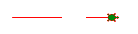
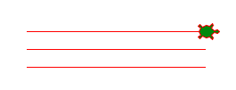
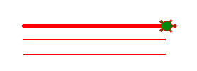
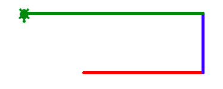
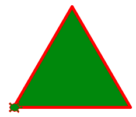
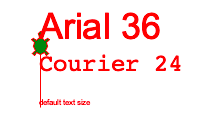
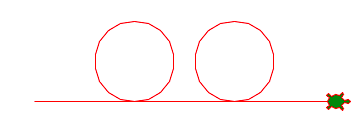

Dessiner
========

Tu as vu les 4 commandes de base pour déplacer la tortue: 
*forward, backward, left* et *right*. Mais tu peux contrôler d'autres aspects du dessin:

- épaisseur du trait
- couleur du trait
- couleur de remplissage

En plus tu peux aussi:

- monter et descendre le stylo
- dessiner des cercles
- ajouter du texte

Monter le stylo
---------------

La tortue peut monter et descendre son stylo.
Ceci lui permet de dessiner des lignes séparées:

.. literalinclude:: draw1.py
   :lines: 2-

:download:`draw1.py <draw1.py>`

Téléporter la tortue
--------------------

La tortue peut aller directement (en ligne droite) à n'importer quel position 
indiquée par des coordonnés (x, y).
La commande ``goto(0, 20)`` va téléporter la tortue à la position (x=0, y=20).

.. literalinclude:: draw2.py
   :lines: 2-

:download:`draw2.py <draw2.py>`

L'épaisseur de ligne
--------------------

Tu peux modifier l'épaisseur du stylo avec la commande ``width(2)``.

.. literalinclude:: draw3.py
   :lines: 2-

:download:`draw3.py <draw3.py>`

La couleur de ligne
-------------------

Tu peux modifier la couleur du stylo, par exemple en blue, avec la commande ``pencolor('blue')``.

Voici les couleurs que tu peux choisir: 

*yellow, gold, orange, red, maroon, violet, pink, magenta, purple, navy, 
blue, sky blue, cyan, turquoise, lightgreen, green, darkgreen, chocolate, 
brown, black, gray, white*

Tu en trouve une centaine de couleurs sur ce site: 
http://cng.seas.rochester.edu/CNG/docs/x11color.html

Fais attention de mettre le nom de la couleur entre apostrophes.
Par exemple:

- ``'Pink'``
- ``'HotPink'``
- ``'DeepPink'``
- ``'Fuchsia'``

.. literalinclude:: draw4.py
   :lines: 2-

:download:`draw4.py <draw4.py>`

Remplir une forme
-----------------

Il est possible de remplir une forme d'une couleur.

Avec la commande ``fillcolor('green')`` tu peux choisir une couleur de remplissage.

Ensuite il faut entourer la forme à remplir, par exemple le triangle, avec les deux commandes::

    begin_fill()
    end_fill()

.. literalinclude:: draw5.py
   :lines: 2-

:download:`draw5.py <draw5.py>`

Ajouter un texte
----------------

Il est possible d'écrire un texte à la position de la tortue avec la commande ``write()``.
Cette commande peut avoir plusieurs arguments. Nous allons en voir deux:
le premier est le texte que tu veux écrire (à mettre entre apostrophe), 
le deuxième définit la police du texte, ainsi que la taille de la police::

    write('texte', font=('police', taille))

La taille de la police par défaut est très petite. Il est préférable que tu l'augmentes.

.. literalinclude:: draw6.py
   :lines: 2-

:download:`draw6.py <draw6.py>`

Dessiner un cercle
------------------

La fonction ``circle(40)`` permet de dessiner un cercle avec un rayon de 40 pixels.
Dans le programme ci-dessous, la tortue dessine deux cercles.

.. literalinclude:: draw7.py
   :lines: 2-

:download:`draw7.py <draw7.py>`

