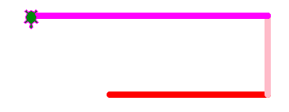

Dessiner
========

Tu as vu les 4 commandes de base pour déplacer la tortue: 
*forward, backward, left* et *right*. Mais tu peux contrôler d'autres aspcets du dessin:

- épaisseur du trait
- couleur du trait
- couleur de remplissage

En plus tu peux aussi:

- monter et descendre le stylo
- dessiner des cercles
- ajouter du text

Monter le stylo
---------------

La tortue peut monter et descendre son style.
Ceci lui permet de dessiner des lignes séparées.

.. image:: draw1.png

.. literalinclude:: draw1.py

:download:`draw1.py <draw1.py>`

Téléporter la tortue
--------------------

La tortue peux aller directement (en ligne droite) à n'importer quel position 
indiquée par des coordonnés (x, y).
La commande ``turtle.goto(0, 20)`` va téléporter la tortue à la position (x=0, y=20).

.. literalinclude:: draw2.py

:download:`draw2.py <draw2.py>`

L'épaisseur de ligne
--------------------

Tu peux modifier l'épaisser du stylo avec la commande ``turtle.width(2)``.

.. literalinclude:: draw3.py

:download:`draw3.py <draw3.py>`

La couleur de ligne
-------------------

Tu peux modifier la couleur du stylo avec la commande ``turtle.pencolor('blue')``.

Voici les couleurs que tu peux choisir: 

*yellow, gold, orange, red, maroon, violet, pink, magenta, purple, navy, 
blue, sky blue, cyan, turquoise, lightgreen, green, darkgreen, chocolate, 
brown, black, gray, white*

N'oublies pas de mettre le nom de couleur entre apostrophes.

.. literalinclude:: draw4.py

:download:`draw4.py <draw4.py>`

Remplir une forme
-----------------

Il est possible de remplir une forme d'une couleur.

Avec la commande ``turtle.fillcolor('green')`` tu peux choisir une couleur de remplissage.

Ensuite il faut entourer la forme à remplir, par exemple le triangle, avec les deux commandes::

    turtle.begin_fill()
    turtle.end_fill()

.. literalinclude:: draw5.py

:download:`draw5.py <draw5.py>`

Ajouter un texte
----------------

Il est possible d'écrire un texte à la position de la tortue.

La police par défaut est très petit. Il est préférable que tu augmente la taille.

.. image:: draw6.png

.. literalinclude:: draw6.py

:download:`draw6.py <draw6.py>`

Dessiner un cercle
------------------

La fonction ``turtle.circle(40)`` permet de dessiner un cercle avec un rayon de 40 pixels.
Dans le programme ci-dessous la tortue dessine deux cercles.

.. literalinclude:: circle.py

:download:`circle.py <circle.py>`

