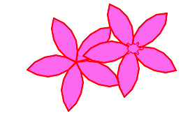
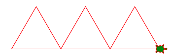
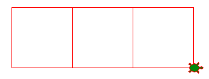
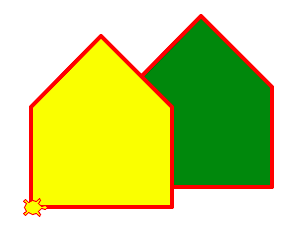

La fonction
===========

Avec les 4 fonctions *forward, backward, left, right* tu peux tout dessiner.
Par contre, dès que ton dessin devient un plus complexe il 

- comporte beaucoup de répétitions
- devient difficile à comprendre.

Le remède est d'utiliser une **fonction** qui permet de

- mettre un bout du code à part
- donner un **nom** à ce code
- **réutiliser** ce code autant de fois que tu veux

Les deux fleurs ci-dessus ont été dessinées avec une fonction ``flower()``.

Définir une fonction
--------------------

Tout d'abord nous devons définir la fonction. Une définition de fonction consiste:

- du **mot-clé** ``def`` (definition)
- du **nom** de la fonction
- de **parenthèses** ``()``
- d'un **deux-points** ``:``
- du **corps** de la fonction contenant le code.

Voici la définition de la fonction triangle::

    def triangle():
        turtle.forward(100)
        turtle.left(120)
        turtle.forward(100)
        turtle.left(120)
        turtle.forward(100)
        turtle.left(120)
        turtle.forward(100)

La définition d'une fonction toute seule ne vas rien dessiner.
Tu dois **appeler** la fonction pour exécuter son code. 
Pour appeler une fonction tu dois écrire:

- le **nom** de la fonction
- des **parenthèses** ``()``

Voici la fonction ``triangle()`` appelée trois fois::

    triangle()
    triangle()
    triangle()

.. literalinclude:: func1.py

:download:`func1.py <func1.py>`

Appeler une fonction dans une fonction
--------------------------------------

Une fonction peut appeler une autre fonction. 
Pour dessiner un carré, nous pouvons d'abord definir une fonction ``side`` qui dessine
juste un côté et tourne de 90 degrées::

    def side():
        turtle.forward(100)
        turtle.left(90)

Ensuite la fonction ``square()`` appelle 4 fois cette fonction::

    def square():
        side()
        side()
        side()
        side()
        turtle.forward(100)

Et finalement tu peux appeler 3 fois la fonction ``square``::

    square()
    square()
    square()

.. literalinclude:: func2.py

:download:`func2.py <func2.py>`

Dessiner des maisons
--------------------

Tu peux reprendre le dessin de la maison vu à l'introduction. 
Nous allons le définir comme fonction. En plus, nous ajoutons un remplissage.
Ceci permet de dessiner des maisons multiples à des positions et danse les couleurs que tu veux.

.. literalinclude:: house.py

:download:`house.py <house.py>`

Dessiner des fleurs
-------------------

Tu peux utiliser deux arcs de cercle de 90 degrés pour dessiner une pétale::

    def petal():
        turtle.begin_fill()
        turtle.circle(50, 90)
        turtle.left(90)
        turtle.circle(50, 90)
        turtle.end_fill()
        turtle.left(18)

Ensuite tu peux combiner 5 pétales pour dessiner une fleur.

.. literalinclude:: flower.py

:download:`flower.py <flower.py>`
