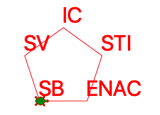
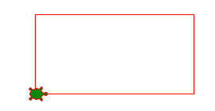
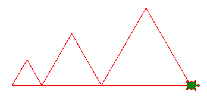
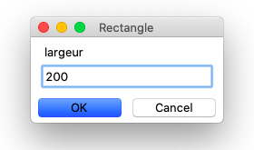
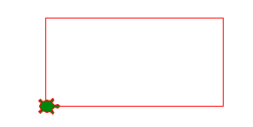
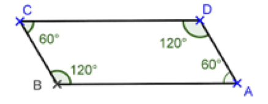
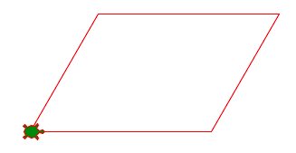

La variable
===========

Parfois nous utilisons la même valeur numérique plusieurs fois dans un programme.
Il est alors pratique de pouvoir donner un nom à cette valeur. 
Une **variable** permet d'associer un **nom** à une **valeur**.

L'exemple ci-dessous montre la tortue qui visite les 5 facultés de l'EPFL.
Les noms des facultés sont stockés dans une ``variable``.

:download:`epfl2.py <epfl2.py>`

Dessiner un rectangle
---------------------

Un rectangle est défini entièrement par deux grandeurs:

- la largeur
- la hauteur

Quand on dessine un rectangle, chaque valeur est utilisée 2 fois.
Tu peux définir ces valeurs au début du programme avec des variables.
Dans le programme tu peut ensuite utiliser ces variables à la places de valeurs numériques.

.. literalinclude:: var1.py
   :lines: 2-

:download:`var1.py <var1.py>`

Changer la valeur d'une variable
--------------------------------

À n'importe quel moment dans un programme, tu peux changer la valeur d'une variable.
Dans l'exemple qui suit, nous mettons d'abord la valeur de la variable ``a`` à 50. 
Ensuite nous la changeons à 100 et finalement à 150.
A chaque fois nous dessinons un triangle qui utilise la valeur de cette variable comme longueur.

.. literalinclude:: var2.py
   :lines: 2-

:download:`var2.py <var2.py>`

Demander une valeur
-------------------

Python permet de demander une valeur à l'utilisateur en utilisant une des fonctions prédéfinies::

  a = numinput('Rectangle', 'largeur')

Cette fonction va ouvrir une fenêtre de dialogue avec
le titre **Rectangle** et un texte pour le paramètre dont il faut donner une valeur, 
ici on va afficher le texte **largeur**.

Tu peux entrer un nombre, par exemple 200. 
Quand tu cliques sur **OK** ce nombre va être mis dans la variable ``a`` .

Le programme suivant demande également la hauteur du rectangle et met cette valeur dans 
la variable ``b``. 

.. literalinclude:: var3.py
   :lines: 2-

Une fois les deux valeurs obtenues, la tortue commence à dessiner le rectangle.

:download:`var3.py <var3.py>`

Dessiner un parallélogramme
---------------------------

Deux angles voisins d'un parallélogramme se complètent pour donner 180 degrés.

Nous pouvons donc calculer l'angle complémentaire selon l'expression::

  left(180-angle)

Il est facile de changer les angles du parallélogramme quand on utilise une variable.
Au lieu de changer 4 valeurs, on modifie une seule valeur au début du programme.
Les 4 angles sont calculés par la suite en utilisant cette variable.

.. literalinclude:: var4.py
   :lines: 2-

:download:`var4.py <var4.py>`