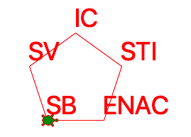
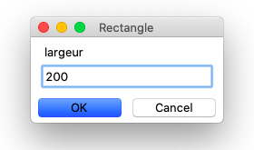
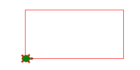
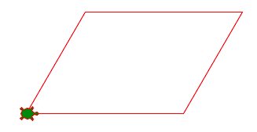

La variable
===========

Parfois nous utilisons la même valeur plusieurs fois dans un programme.
Il est alors pratique de pouvoir donner un nom à cette valeur. 
Une **variable** permet d'associer un **nom** à une **valeur**.

L'exemple ci-dessous montre la tortue qui visite les 5 facultés de l'EPFL.
Les noms des facultés sont stockés dans une ``variable``.

:download:`epfl2.py <epfl2.py>`

Dessiner un rectangle
---------------------
Quand on dessine un rectangle, on utilise la largeur et la hauteur 2 fois.
Il est pratique dans ce cas, de donner un nom à ces valeurs.
C'est exactement ce que font les variables.
Une variable est un nom qui est associé à une valeur numérique.
Au début du programme on definit les variable.
Dans le programme on peut par la suite utiliser ces variables à la places des valeurs numériques.

.. literalinclude:: var1.py

.. image:: var1.png

:download:`var1.py <var1.py>`

Changer la valeur d'une variable
--------------------------------

A n'importe quel moment dans un programme tu peux changer la valeur d'une variable.
Dans l'example qui suit, nous mettons d'abord la valeur 100 dans la variable ``a``.
Ensuite nous dessinons un triangle.

Plus tard dans le programme nous changeons la valeur de la variable ``a`` vers 200.
Nous dessinons de nouveau un triangle, avec exactement le même code, mais cette fois le triangle est deux fois plus grand.

.. literalinclude:: var2.py

.. image:: var2.png

:download:`var2.py <var2.py>`

Demander une valeur
-------------------

Python permet de demander une valeur à l'utilisateur avec la commande::

  a = turtle.numinput('Rectangle', 'largeur')

Cette commande va ouvrir une fenêtre de dialogue avec
le titre **Rectangle** et le dialogue **largeur**.

Tu peux entrer un nombre, par exemple 200. 
Quand tu clique sur **OK** ce nombre va être affecté à la variable ``a`` .

Le programme demande également la hauteur du rectangle et met cette valeur dans 
la variable ``b``. 

.. literalinclude:: var3.py

Une fois les deux valeurs obtenus, la tortue commence à dessiner le rectangle.

:download:`var3.py <var3.py>`

Dessiner un parallélogramme
---------------------------

Deux angles voisin d'un parallélogram se complètent pour donner 180 degrés.
Nous pouvons donc calcule l'angle complémentaire selon l'expression::

  turtle.left(180-angle)

Il est facile de changer l'angle de parallélogramme. 
On le change une fois, et le programme calcule automatiquement les 4 angles 
que la tortue doi 

.. literalinclude:: var4.py

:download:`var4.py <var4.py>`