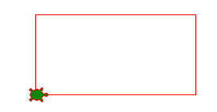
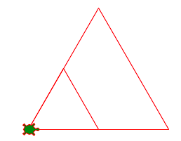

Donner un nom a une valeur
==========================

Parfois nous utilisons les mêms valeurs plusieurs fois dans un programme.
Par exemple quand on dessine une carré on utilise la longeur 4 fois.
Quand on dessine un rectangle, on utilise la largeur et la hauteur 2 fois.

Il est pratique dans ce cas, de donner un nom à ces valeurs.
C'est exactement ce que font les variables.
Une variable est un nom qui est associé à une valeur numérique.
Au début du programme on definit les variable.
Dans le programme on peut par la suite utiliser ces variables à la places des valeurs numériques.

.. literalinclude:: var1.py

:download:`var1.py <var1.py>`

Changer la valeur d'une variable
--------------------------------

.. sidebar:: Variable
        :subtitle: Changer une variable

  La valeur d'une variable peut être changé à n'import quel moment.
  On utilise une affectation du style ``var = 3``.

A n'importe quel moment dans un programme tu peux changer la valeur d'une variable.
Dans l'example qui suit, nous mettons d'abord la valeur 100 dans la variable ``a``.
Ensuite nous dessinons un triangle.

Plus tard dans le programme nous changeons la valeur de la variable ``a`` vers 200.
Nous dessinons de nouveau un triangle, avec exactement le même code, mais cette fois le triangle est deux fois plus grand.

.. literalinclude:: var2.py

:download:`var2.py <var2.py>`