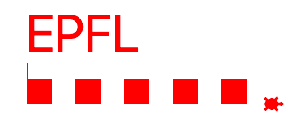
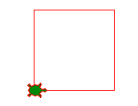

Répéter quelque chose
=====================

Dans un programme il a souvent des séquences qui se répètent.
On utilise alors une structure qu'on appelle **boucle** pour indiquer au programme
de répèter certains instructions.

Le nouveau logo de l'EPFL utilise des grands pixels rouges. 
Ci-dessous, la tortue dessine dans une boucle les 4 cotés du carré rouge.
Ensuite la tortue répète dans une deuxième boucle ces carrés 5 fois.

:download:`epfl3.py <epfl3.py>`

Dessiner un carré
-----------------

On peut dessiner un carre en répétant 4 fois ces instructions

.. literalinclude:: square1.py

:download:`square1.py <square1.py>`

Dans Python il a une instruction qui permet de répéter des lignes de code.
C'est instruction s'appelle **boucle**.
Pour répéter des lignes de code un certain nombre de fois il faut écrire::

    for i in range(10):
        code
        ...
