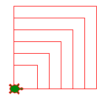
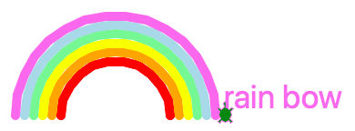

La boucle
=========

Dans un programme, il a souvent des bouts de code qui doivent être répétés.
On utilise alors une structure qu'on appelle **boucle** pour indiquer au programme
de répéter certaines instructions.

Le nouveau logo de l'EPFL utilise des grands carrés rouges. 
Ci-dessous, la tortue dessine dans une boucle les 4 côtés du carré rouge.
Ensuite la tortue répète dans une deuxième boucle ces carrés 5 fois.

.. image:: epfl3.png

:download:`epfl3.py <epfl3.py>`

Dessiner un carré
-----------------

On peut dessiner un carré en répétant 4 fois ces instructions

.. literalinclude:: square1.py

:download:`square1.py <square1.py>`

.. image:: square1.png

La **boucle** est une structure qui permet de répéter des lignes de code.
Pour répéter un bout de code un certain nombre de fois (ici 10 fois par exemple), on écrit::

    for i in range(10):
        code
        ...

Cette structure est appelée la **boucle for**. Elle se compose des éléments suivants:

- le mot-clé ``for``
- une variable, souvent appelée ``i``
- le mot-clé ``in``
- la fonction ``range(n)``
- le signe deux-points ``:``

En Python, le signe *deux-points* est toujours suivi de quelques lignes code indenté.
Normalement les lignes de code qui suivent sont décalées 4 espaces vers la droite.

Le programme du carrée devient beaucoup plus compact si on utilise une boucle. 
Au lieu de 8 lignes, on n'auras besoin que de 3 lignes.

.. literalinclude:: square2.py

:download:`square2.py <square2.py>`

Le compteur de boucle
---------------------

Le ``i`` dans l'expression de boucle ``for i in range(4)`` est bien une variable.
En fait c'est une variable qui va prendre successivement les valeurs 0, 1, 2, 3.

En Python, comme dans la programmation en général, on a l'habitude de toujours commencer à compter à 0. 
C'est la raison pour laquelle on s'arrête à 3, et non pas à 4 dans ``range(4)``. 
Ce sont bien 4 répétitions de la boucle: 0, 1, 2, et 3. 

Nous allons utiliser la fonction ``write(i)`` pour 
écrire cette valeur du compteur de boucle à chaque sommet du carré.

.. image:: square3.png

.. literalinclude:: square3.py

:download:`square3.py <square3.py>`

Une boucle dans une boucle
--------------------------

Tu peux même mettre une boucle dans une boucle.
On appelle ça  des **boucles imbriquées**. 

Dans l'exemple suivant, tu as une première boucle qui se répète 7 fois.
Mais à l'intérieur il y une deuxième boucle qui dessine un carré. 
La longueur du carré est donnée par la variable ``a``. 
Cette valeur est initialisée avant la boucle avec::

    a = 20

Après chaque passage de boucle cette valeur est augmentée de 20::

    a += 20

L'opérateur ``+=`` est un raccourci pour dire ``a = a + 20``

.. image:: square4.png

.. literalinclude:: square4.py

:download:`square4.py <square4.py>`

Une façon plus compacte est d'utiliser un indicateur de plage de la forme suivante::

    for a in range(40, 160, 20):

- la valeur 40 est la valeur initiale (au premier passage: a=40)
- la valeur 160 la valeur finale (mais pas atteint, au dernier passage a<160)
- la valeur 20 est l'incrément (on ajoute 20 à chaque passage)

La variable ``a`` va donc prendre successivement les valeurs 40, 60, 80, 100, 120, et 140.

.. literalinclude:: square5.py

:download:`square5.py <square5.py>`

Dessiner un polygone
--------------------

En utilisant une boucle tu peux très facilement programmer ta tortue pour dessiner un polygone.
Si le polygone possède ``n = 6`` sommet, la tortue doit tourner à chaque sommet::

    left(360/n)

.. image:: polygon1.png

.. literalinclude:: polygon1.py

:download:`polygon1.py <polygon1.py>`

Dessiner plusieurs polygones
----------------------------

De nouvea,u tu peux imbriquer deux boucles l'une dans l'autre pour dessiner plusieurs polygones.
Cette fois nous utilisons l'expression de boucle suivante::

    for n in range(3, 7):

Le compteur de boucle ``n`` ne commence cette fois pas à 0 mais à 3. 
Il va parcourir successivement les valeurs 3, 4, 5, et 6 (il doit rester strictement inférieur à 7). 
Dans la boucle intérieure la tortue va donc dessiner un triangle, un carré, 
un pentagone et un hexagone.

.. image:: polygon2.png

.. literalinclude:: polygon2.py

:download:`polygon2.py <polygon2.py>`

Dessiner une étoile
-------------------

Dessiner une étoile est similaire à dessiner un polygone régulier.
En fait, on peut même considérer une étoile comme un polygone régulier.
Pour une étoile, on a aussi ces deux conditions qui sont valables:

- touts les côtés ont la même longueur
- touts les angles ont la même valeur

Il suffit de modifier la formule du calculer d'angle::

    left(360/n*m)

Vous pouvez expérimenter avec différents valeurs pour::

    a = 200
    n = 5
    m = 2

Tu peux constater que pour ``m=1``, tu obtiens le polygone ordinaire, l'angle valant alors 360/n.

.. image:: polygon3.png

.. literalinclude:: polygon3.py

:download:`polygon3.py <polygon3.py>`

Dessiner une étoile coloriée
----------------------------

Pour remplir le dessin de l'étoile il suffit d'appeler ces deux fonctions 
avant et après les lignes de code qui créent le dessin::

    begin_fill()
    end_fill()

.. image:: polygon4.png

.. literalinclude:: polygon4.py

:download:`polygon4.py <polygon4.py>`
 

Dessiner un arc en ciel
-----------------------

Pour dessiner un arc-en-ciel, nous définissons d'abord une liste de couleurs::

    colors = ('red', 'orange', 'yellow', 'lightgreen', 'lightblue', 'violet')

Cette liste contient 6 éléments, et la **boucle for** avec une liste permet de répéter 6 fois, 
avec la variable ``color`` prenant successivement les valeurs dans la liste ``colors``::

    for color in colors:
        pencolor(color)

Nous commençons à dessiner un demi-cercle, donc un arc de 180 degrès et un rayon inital de 40::

    circle(r, 180)

Arrivé du coté gauche de l'arc nous faisons ceci:

- tourner de 90 degrés à gauche
- soulever le stylo
- avancer le diamètre de l'arc rouge (2*r = 80)
- avancer encore l'épaisseur du trait (d=10)
- redescendre le stylo
- tourner de 90 degrés
- augmenter le rayon pour le prochain arc en orange (40+10 = 50)

.. literalinclude:: rainbow.py

:download:`rainbow.py <rainbow.py>`

