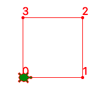
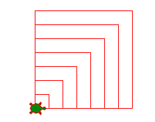
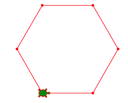
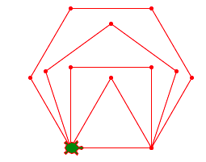
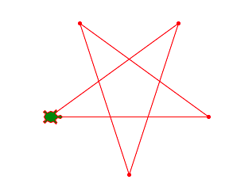
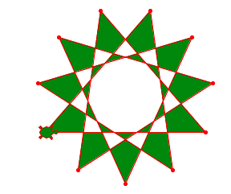

La boucle
=========

Dans un programme il a souvent des séquences qui se répètent.
On utilise alors une structure qu'on appelle **boucle** pour indiquer au programme
de répèter certains instructions.

Le nouveau logo de l'EPFL utilise des grands pixels rouges. 
Ci-dessous, la tortue dessine dans une boucle les 4 cotés du carré rouge.
Ensuite la tortue répète dans une deuxième boucle ces carrés 5 fois.

.. image:: epfl3.png

:download:`epfl3.py <epfl3.py>`

Dessiner un carré
-----------------

On peut dessiner un carre en répétant 4 fois ces instructions

.. literalinclude:: square1.py

:download:`square1.py <square1.py>`

.. image:: square1.png

Dans Python il a une instruction qui permet de répéter des lignes de code.
C'est instruction s'appelle **boucle**.
Pour répéter des lignes de code un certain nombre de fois il faut écrire::

    for i in range(10):
        code
        ...

Le même programme du carrée devient beaucoup plus compact si tu utilise une boucle. 
Au lieu de 8 lignes tu fin

.. literalinclude:: square2.py

:download:`square2.py <square2.py>`

Le compteur de boucle
---------------------

Le ``i`` dans l'expression de boucle ``for i in range(4)`` est bien une variable.
En fait c'est une variable qui va prendre succéssivement les valeurs 0, 1, 2, 3.

En Python on a l'habitude de commencer à compter à 0. 
C'est l'a raison aussi qu'on s'arrête à 3, un de moins que la valeur 4 dans ``range(4)``.

Nous allons utiliser la fonction ``turtle.write(i)`` pour 
écrire cette valeur dans chaque sommet.

.. literalinclude:: square3.py

:download:`square3.py <square3.py>`

Une boucle dans une boucle
--------------------------

Tu peux même mettre une boucle dans une boucle.
On appelle ça  des **boucles imbriquées**. 

Dans l'exemple suivant tu as une première boucle qui se répète 7 fois.
Mais à l'interieur il y une deusième boucle qui dessine un carré. 
La longuer du carré est donné par la variable ``a``. 
Cette valeur est initialisé avant la boucle avec::

    a = 20

Après chaque passage de boucle cette valeur est augmenté de 20::

    a += 20

L'operéateur ``+=`` est un raccourci pour dire ``a = a + 20?``

.. literalinclude:: square4.py

:download:`square4.py <square4.py>`

Dessiner un polygone
--------------------

En utilisant une boucle tu peux très facilement programmer ta tortue pour dessiner un polygone.
Si le polygone possède ``n = 6`` sommet, la tortue doit tourner à chaque sommet::

    turtle.left(360/n)

.. literalinclude:: polygon1.py

:download:`polygon1.py <polygon1.py>`

Dessiner plusieurs polygones
----------------------------

De nouveau tu peux impriquer deux boucles pour dessiner plusieurs polygones.
Cette fois nous utilisons l'expression de boucle suivante::

    for n in range(3, 7):

Le compteur de boucle ``n`` ne commence cette fois pas à 0 mais à 3. 
Il va parcourir à tour de roles les valeurs 3, 4, 5, et 6. 
Dans la boucle intérieur la tortue va nous dessiner donc un triangle, un carré, 
un pentagone et un hexagone.

.. literalinclude:: polygon2.py

:download:`polygon2.py <polygon2.py>`

Dessiner une étoile
-------------------

Dessiner une étoile est similaire à dessiner un polygone régulier.
En fait, on peut même considérer une étoile commme un polygone régulier.
Pour une étoile on a aussi ces deux conditions:

- toutes les côtés ont la même longueur
- toutes les angles ont la même valeur

Il suffit de modifier la formule pour calculer l'angle::

    turtle.left(360/n*m)

Vous pouvez expérimenter avec différents valeurs pour::

    a = 200
    n = 5
    m = 2

Vous allez même constater que pour ``m=1`` vous revenez vers le polygone ordinaire.

.. literalinclude:: polygon3.py

:download:`polygon3.py <polygon3.py>`

Dessiner une étoile remplie
---------------------------

Un dessin de la tortue peut être rempli. 
Il suffit d'appeler ces deux fonctions avant et après::

    turtle.begin_fill()
    turtle.end_fill()

.. literalinclude:: polygon4.py

:download:`polygon4.py <polygon4.py>`
 

