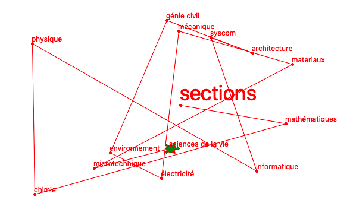
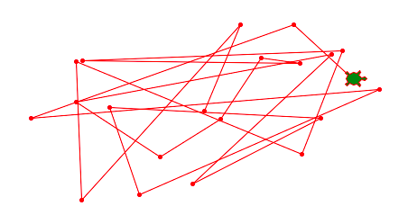
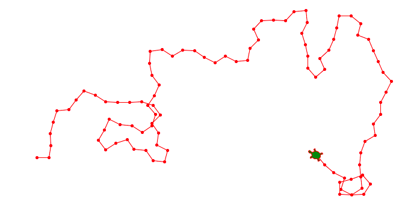
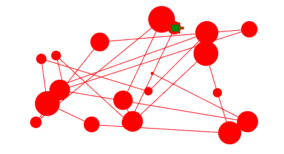
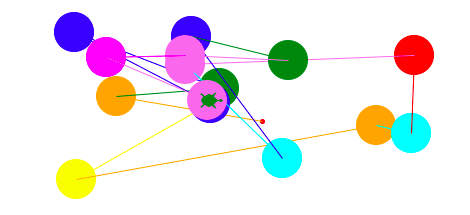

Choisir de façon aléatoire
==========================

Dans des jeux ou des animations, il est souvent nécessaire de pouvoir calculer des valeurs aléatores. 
Le module ``random`` permet de trouver des valeurs aléatoires.

Partant du centre, la tortue visite les 13 sections de l'EPFL 
qui se trouvent tous à des positions aléatoires sur cette carte.

:download:`epfl4.py <epfl4.py>`

Position aléatoire
------------------

Pour pouvoir utiliser des fonctions aléatoirs nous devons d'abord importer le module ``random``::

    import random

La fonction ``random.randint(-100, 100)`` retourne une valeur aléatoire 
qui se situe entre les deux valeurs -100 et 100.

.. literalinclude:: random1.py

:download:`random1.py <random1.py>`

Angle aléatoire
---------------

Pour simulier la marche aléatoire d'une fourmi, nous pouvons chosir l'angle à tourner
à chaque itération comme::

    angle = random.randint(-90, 90)

.. literalinclude:: random2.py

:download:`random2.py <random2.py>`

Taille aléatoire
----------------

Ci-dessous la tortue va à une position (x, y) aléatoire et choisit une taille aléatoire 
pour le cercle à dessiner::

    size = random.randint(10, 50)  
    turtle.goto(x, y)
    turtle.dot(size)

.. literalinclude:: random3.py

:download:`random3.py <random3.py>`

Couleur aléatoire
-----------------

La fonction ``random.choice(list)`` permet de choisir un élément dans une liste. 
Il faut d'abord definir une liste::

    colors = ('red', 'blue', 'green', 'violet', 'yellow', 'cyan', 'orange', 'magenta')

Ensuite un élément aléatoire est choisi de cette liste et utilisé comme nouvelle
couleur de la tortue::

    color = random.choice(colors)
    turtle.pencolor(color)

.. literalinclude:: random4.py

:download:`random4.py <random4.py>`

