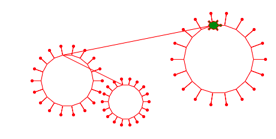
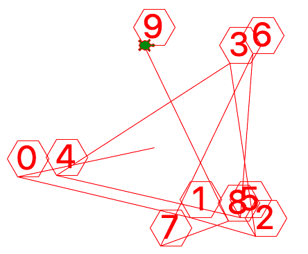
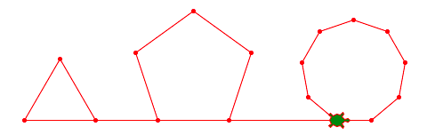
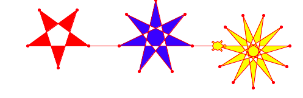

La fonction
===========

Une fonction permet de donner un nom à un bout de code. 
C'est un peu comme une variable qui est un nom pour une valuer.
Mais ici on donne un nom pour un morceau de code.

Dans l'exemple ci-dessous la tortue dessine un virus.
Une fonction ``virus(d)`` a été définit qui permet à la tortue de dessiner
très facilment les 3 virus qui ont tous une taille différente, en réutilisant un code.

:download:`virus.py <virus.py>`

Définir une fonction
--------------------

Nous allons retourner à plusieurs figures que nous avons fait dans les 
chapitres précédents et nous allons les refaire à l'aide de fonctions.

Nous définission la fonction ``polygone`` avec les lignes::

    def polygon():
        for i in range(6):
            turtle.forward(30)
            turtle.left(60)

Cette fonction dessine un hexagone d'une longueur de côté de 30 pixels.
Dans la suite nous appelons cette fonctions 10 fois avec tout simplement::

    polygon()

Dans la boucle nous choisissons 10 fois une position aléatoire ou dessiner l'hexagone.

.. literalinclude:: function1.py

:download:`function1.py <function1.py>`

Nous avons deux avantages:

- le code est plus **court** : ici nous économisons 9x3 lignes de code
- le code est plus **lisibile** : on comprend tout de suite l'expression *polygon()*

Une fonction avec des arguments
-------------------------------

La fonction ``polygon()`` au-paravant est certes pratiques, mais pas très flexible.
Elle ne permet que de dessiner des hexagones, et seulement une taille fixe.

Tu vas découvir les arguments d'une fonction. 
Les arguments sont des variables qui sont passé à la fonction et qui permettent 
de modifier la tâche de la fonction.

Nous allons donner deux arguments à la fonction:

- le nombre de sommets **n**
- la longueur d'un côté **a**

Voici la nouvelle définition::

    def polygon(n, a):
        for i in range(n):
            turtle.forward(a)
            turtle.dot()
            turtle.left(360/n)

Nous povons maintenant appler la fonction 3 fois avec des arguments différents::

    polygon(3, 80)
    polygon(5, 80)
    polygon(9, 40)

.. literalinclude:: function2.py

:download:`function2.py <function2.py>`

Une fonction avec 4 arguments
-----------------------------

Nous reprenons l'étoile d'un programme précédent. 
Nous allons la transformer en fonction avec 4 parametres: 

- le nombre de sommets **n**
- la distance vers le prochain sommet **m**
- la longueur d'un côté **a**
- la couleur de replissage **color**

Dans l'appel de fonction, la fonction a maintenant 4 arguments::

    star(5, 2, 100, 'red')
    star(7, 3, 120, 'blue')
    star(11, 6, 120, 'yellow')

.. literalinclude:: function3.py

:download:`function3.py <function3.py>`