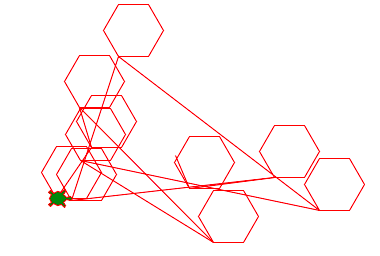

La fonction avec arguments
==========================

Une fonction permet de donner un nom à un bout de code. 
C'est similaire à une variable qui associe un nom à une valuer.

Dans l'exemple ci-dessous la tortue dessine un virus.
Une fonction ``virus(d)`` a été défini qui permet à la tortue de dessiner
des virus de taille différente. La fonction a un paramètre ``d`` qui est la taille du virus.

:download:`virus.py <virus.py>`

Définir une fonction
--------------------

Nous allons retourner à plusieurs figures que nous avons fait dans les 
chapitres précédents et nous allons les refaire à l'aide de fonctions.

Nous définission la fonction ``polygone`` avec les lignes::

    def polygon():
        for i in range(6):
            turtle.forward(30)
            turtle.left(60)

Cette fonction dessine un hexagone d'une longueur de côté de 30 pixels.
Dans la suite nous appelons cette fonctions 10 fois avec tout simplement::

    polygon()

Dans la boucle nous choisissons 10 fois une position aléatoire ou dessiner l'hexagone.

.. literalinclude:: function1.py

:download:`function1.py <function1.py>`

Une fonction avec des arguments
-------------------------------

La fonction ``hexagon()`` au-paravant est certes pratiques, mais pas très flexible.
Elle ne permet que de dessiner des hexagones, et seulement une taille fixe.

Pour avoir cette flexibilité tu dois donner des arguments à la fonction. 
Les arguments d'une fonction sont des variables qui sont passé à la fonction lors de l'appel de fonction.
Ces arguments permettent de modifier la tâche de la fonction.

Nous allons donner deux arguments à la fonction:

- le nombre de sommets **n**
- la longueur d'un côté **a**

Voici la nouvelle définition::

    def polygon(n, a):
        for i in range(n):
            turtle.forward(a)
            turtle.dot()
            turtle.left(360/n)

Nous povons maintenant appler la fonction 3 fois avec des arguments différents::

    polygon(3, 80)
    polygon(5, 80)
    polygon(9, 40)

.. literalinclude:: function2.py

:download:`function2.py <function2.py>`

Une fonction avec 4 arguments
-----------------------------

Nous reprenons l'étoile vu précédemment. 
Nous allons la transformer en fonction avec 4 parametres: 

- le nombre de sommets **n**
- la distance vers le prochain sommet **m**
- la longueur d'un côté **a**
- la couleur de replissage **color**

Dans l'appel de fonction, la fonction a maintenant 4 arguments::

    star(5, 2, 100, 'red')
    star(7, 3, 120, 'blue')
    star(11, 6, 120, 'yellow')

.. literalinclude:: function3.py

:download:`function3.py <function3.py>`