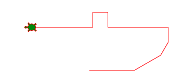
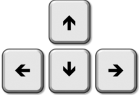
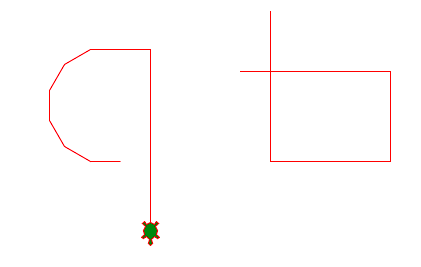
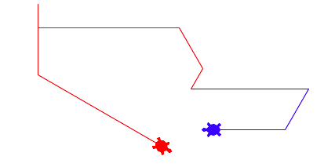
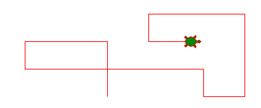
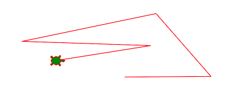

Evénements
==========

Quand tu utilises le clavier ou la souris de ton ordinateur, tu t'y attends qu'il réagit immédiatement.
En informatique on appelle un telle action de l'utilisateur un **event**. 
Un programme est toujours à l'écoute des événements et répond par des actions.

Utiliser les touches
--------------------

Beaucoup de jeux utilisent des touches pour faire bouger le personnage du jeu.
Souvent ce sont les touches WASD du clavier.

.. image:: wasd.png

Tu peux programmer ta tortue pour la bouger avec ces touches.
La fonction ``onkey(forward, 'w')`` associe la touche **W** avec la fonction ``forward``.

Tu dois définir cette fonction, par exemple avancer de 30 pixels::

    def forward():
        turtle.forward(30)

On appelle ça de définir une fonction de **callback** pour l'événement. 
Voici la définition des 4 fonctions de callback pour les 4 touches de direction WASD::

    turtle.onkey(forward, 'w')
    turtle.onkey(backward, 's')
    turtle.onkey(left, 'a')
    turtle.onkey(right, 'd')

Pour que la tortue commence à écouter aux événements, tu dois appeler ``turtle.listen()``.

Essaye maintenant de contrôler la tortue avec les touches WASD et de faire un dessin.

.. literalinclude:: event1.py

:download:`event1.py <event1.py>`

Utiliser les flèches
--------------------

Si tu préfère les flèches, tu peux aussi programmer ta tortue pour la bouger avec les touches de direction.

Les 4 touches de direction ont les noms **Up, Down, Left, Right**.
Voici la défintion des 4 fonctions callback::

    turtle.onkey(forward, 'Up')
    turtle.onkey(backward, 'Down')
    turtle.onkey(left, 'Left')
    turtle.onkey(right, 'Right')

Tu peux combiner les touche WASD avec les flèches. 
Ceci te donne deux méthodes différentes pour bouger la tortue.

.. literalinclude:: event2.py

:download:`event2.py <event2.py>`

Effacer l'écran
---------------

Tu peux ajouter d'autres fonctions, comme:

- effacer l'écran (clear)
- retourner la tortue à la position initiale (home)
- remettre en situation initial (reset)
- quitter (bye)

Comme ces fonctions n'ont pas d'argument, tu n'as pas besoin de redéfinir séparément ces fonctions.
Tu peux directement mettre leur nom (sans les parenthèses) dans la définition des fonctions callback::

    turtle.onkey(turtle.home, 'h')
    turtle.onkey(turtle.clear, 'c')
    turtle.onkey(turtle.reset, 'r')
    turtle.onkey(turtle.bye, 'q')

Tu peux également ajouter des raccourcis pour faire monter et descendre le stylo::

    turtle.onkey(turtle.up, 'u')
    turtle.onkey(turtle.down, 'd')

Ceci te permet de dessiner des lignes séparées.

Voici le programme en entier.

.. literalinclude:: event3.py

:download:`event3.py <event3.py>`

La fonction lambda
------------------

La **fonction lambda** est une courte fonction définit définit en une seul ligne. 
Cette fonction ne porte pas de nom, et on l'appelle aussi **fonction anonyme**. 
Au lieu d'écrire ::

    def forward():
        turtle.forward(30)

tu peux écrire ::

    lambda : turtle.forward(30)

Avec les fonctions lambda notre programme devient très court.

.. literalinclude:: event4.py

:download:`event4.py <event4.py>`

Contrôler deux tortues
----------------------

Dans la **programmation orienté-objet** on modélise le monde par

- des **classes**, 
- des **objets**, et
- des **méthodes**.

Notre tortue est un objet de la classe ``Turtle``. Jusqu'à maintenant tu as toujours 
travaillé avec un seul objet. Mais tu peux créer plusieurs objets (tortues) 
et leur donner des noms différents. 

Ceci définit deux objets différents: une tortue **Alice** et une tortue **Bob**::

    alice = turtle.Turtle()
    bob = turtle.Turtle()

Un objet a des **attributs** tel que sa couleur. Tu peux donner une couleur différente à 
Alice et à Bob::

    alice.color('red')
    bob.color('blue')

Tu as déjà vu les méthodes (forward, left, right, etc.) 
que tu as utilisé pour l'objet par défaut ``turtle``.
Pour contrôler une tortue spécifique tu ajoute la méthode à son nom. Par exemple::

    alice.forward(30)
    bob.left(30)

Tu peux utiliser les touches WASD pour contrôler le mouvement d'Alice et 
les touches de direction pour contrôler le mouvement de Bob. 

.. literalinclude:: event5.py

:download:`event5.py <event5.py>`

Coordonnées absolues
--------------------

Les commandes *left, right, forward, backward* se référent 
à la position et l'orientation actuelle de la tortue. Quand la tortue est tourné vers le bas,
les directions pour nous sont invérsés, et c'est difficile de la controler.

Une autre façon de controler la tortue est d'utiliser des coordonnées (x, y).
Nous les définissons au début du programme, ainsi qu'une distance de déplacement ``d`` ::

    x = 0
    y = 0
    d = 20

A l'intérieur des 4 fonctions nous voulons accéder à ces variables globales. 
Pour ne pas créer une nouvelle variable locale de même nom, 
nous devons declarer les valeurs que nous affectons avec le mot-clés ``global``::

    global x
    global y

Avec la touche **Up/Down** nous incrémentons ou décrémentons la variable y. 
Avec la touche **Left/Right** nous incrémentons ou décrémentons la variable x.

.. literalinclude:: event6.py

:download:`event6.py <event6.py>`

Allers vers la souris
---------------------

Tu peux aussi reagir au clic de la souris.
Utilise la fonction ::

    turtle.onscreenclick(move)

pour désigner la fonction ``move`` comme fonction de callback pour le clic de la souris. ::

    def move(x, y):
        turtle.setposition(x, y)

Tu pourrais encore raccourcir ceci et directement déclarer::

    turtle.onscreenclick(turtle.setposition)

Toutes les lignes sont des segments droit, et la tortue ne change pas d'orientation.

.. literalinclude:: event7.py

:download:`event7.py <event7.py>`

