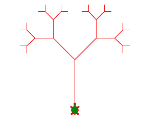
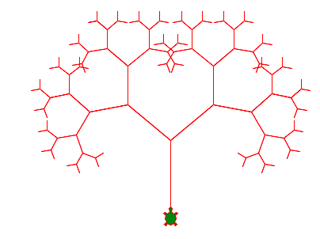

Récursivité
===========

En informatique une fonction qui contient un appel à elle-même est appelé récursif. 

Un arbre récursif
-----------------

.. literalinclude:: tree1.py

:download:`tree1.py <tree1.py>`

En changeant les paramètres::

    d = 0.7         # decreasing factor
    alpha = 50      # turning angle
    l = 100         # initial length

